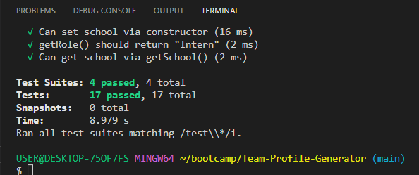
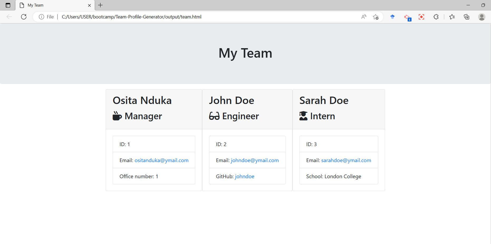

# Team-Profile-Generator

## Description

This Node.js command-line application will take in information about employees on a software engineering team, and then generate an HTML webpage that displays summaries for each person's basic information.  This makes it easy to have quick access to their emails and Github profiles.

The Team-Profile-Generator have classes for each team member which will be exported for tests from the "_tests_" directory. The first class the parent class "Employee" have these properties and methods:

1. name

2. id

3. email

4. getName()

5. getId()

6. getEmail()

7. getRole()—returns 'Employee'

The Parent class "Employee" will be extended/added other three classes, "Manager, Engineer and Intern".  In addition to "Employee"s properties and methods, each class has it's own properties and methods.  The "Manager"s class have the following:

1. officeNumber

2. getRole()—overridden to    return 'Manager'

The "Engineer"s class properties and methods:

1. github—GitHub username

2. getGithub()

3. getRole()—overridden to return 'Engineer'

The "Intern"s class have the following:

1. school

2. getSchool()

3. getRole()—overridden to return 'Intern'

This is the screenshot of the tests results from the four(4) classes, "Employee, Manager, Engineer and Intern" 

## Usage

When a user initialize the Team profile generator application, they are prompted to enter the team manager's basic info:

Name

Employee ID

Email address

Office number

When a user enters those basic informations, the user is presented with a menu with options to the following:

Add an engineer

Add an intern

Finish building the team

When a user choose the engineer option, the user is prompted to enter the basic information for the engineer and then taken back to the menu.

Engineer's Name

ID

Email

GitHub username

When a user choose the intern option, the user is prompted to enter the basic information for the intern and then taken back to the menu.

Intern’s name

ID

Email

School

When a user decides to finish buliding their team, they exit the Team profile generator application and the HTML is generated.  This is the Screenshot of the webpage generated.

